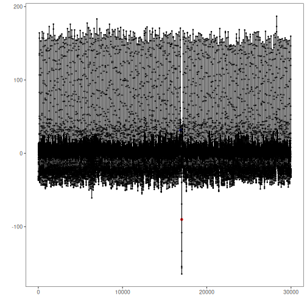

Overview

This notebook demonstrates a simple anomaly detection workflow using ECG series
from the UCR Time Series Anomaly Archive. We will:

- Load the ECG dataset provided by the `united` package
- Visualize a selected series and its labels
- Train a baseline detector and generate anomaly predictions
- Evaluate performance using standard and soft (tolerant) metrics

Dataset notes
- Univariate time series with labeled anomalous intervals
- Recommended use: univariate anomaly detection
- Source: https://paperswithcode.com/dataset/ucr-anomaly-archive


## Load packages and dataset
Load the required packages for data access, modeling, visualization, and evaluation.

``` r
library(united)
library(daltoolbox)
library(daltoolboxdp)
library(harbinger)
library(tspredit)
```

Load the ECG dataset into memory using the package data helper.

``` r
## Load series ----------------------
data(ucr_ecg)
```


``` r
# Select a representative series for the experiment
series <- ucr_ecg[[3]]
# Quick visualization of values over time
plot(as.ts(series$value))
```


## Event detection experiment
Define a detection method and train it with a subset of the series.

``` r
# Establish an autoencoder-based detector
# Alternative: uncomment to try ARIMA
# model <- hanr_arima()
model <- han_autoencoder(3, 2, autoenc_ed, num_epochs = 100)
```


``` r
# Fit the model on a training window (subset for speed)
train <- series[1:5000,]
model <- fit(model, train$value)
```


``` r
# Produce anomaly detections for the whole series
detection <- detect(model, series$value)
```


## Results analysis
Inspect detections, visualize overlays, and compute metrics.

``` r
# Filter detected positives for quick inspection
print(detection |> dplyr::filter(event == TRUE))
```

```
##     idx event    type
## 1 17024  TRUE anomaly
```

Visual analysis

``` r
# Plot predictions (blue) versus true labels (red bands)
grf <- har_plot(model, series$value, detection, series$event)
plot(grf)
```



Evaluate metrics

``` r
# Point-wise evaluation (no temporal tolerance)
ev <- evaluate(model, detection$event, series$event)
print(ev$confMatrix)
```

```
##           event      
## detection TRUE  FALSE
## TRUE      0     1    
## FALSE     1     29998
```


``` r
# Soft evaluation with temporal tolerance window (sw = 200)
ev_soft <- evaluate(har_eval_soft(sw = 200), detection$event, series$event)
print(ev_soft$confMatrix)
```

```
##           event         
## detection TRUE  FALSE   
## TRUE      0.38  0.62    
## FALSE     0.62  29998.38
```

``` r
print(ev_soft$accuracy)
```

```
## [1] 0.9999587
```

``` r
print(ev_soft$F1)
```

```
## [1] 0.38
```

## References

- Chandola, V., Banerjee, A., & Kumar, V. (2009). Anomaly detection: A survey. ACM Computing Surveys, 41(3), 1–58.

